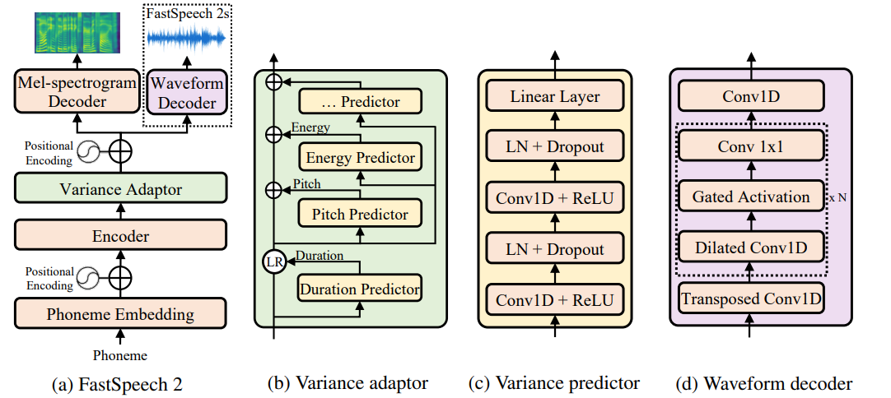

# TTS project
Implementation of [FastSpeech 2: Fast and High-Quality End-to-End
Text-to-Speech](https://arxiv.org/pdf/2006.04558v8.pdf)
<p align="center">
  
</p>

## Installation guide
Run
```shell
chmod +x setup.sh & ./setup.sh
```
to install all libs and to download training data and vocoder checkpoint.

## Train running guide
In order to recreate results, use `fastspeech2.json`:
```shell
python3 train.py -c hw_tts/configs/fastspeech2.json 
```

## Test running guide
Download model checkpoint with `test_setup.sh`:
```shell
chmod +x test_setup.sh & ./test_setup.sh
```
Run test with
```shell
python3 test.py \
   -c default_test_model/fastspeech2.json \
   -r default_test_model/model.pth
```
it will create `output` directory and write audio for each text `test_text.txt` with speed=1.0, energy=1.0 and pitch=1.0.
You can change texts source with flag `-t` and configure speed, energy and pitch with flags `-s`, `-e`, `-p` respectively:
```shell
python3 test.py \
   -c default_test_model/fastspeech2.json \
   -r default_test_model/model.pth \
   -s 0.7 \
   -p 1.2 \
   -e 1.5 \
   -t PATH_TO_YOUR_TXT
```

Run
```shell
python3 test.py \
   -c default_test_model/fastspeech2.json \
   -r default_test_model/model.pth \
   -a True
```
to get audio files for each required configurations (general, +20%/-20% for each param).